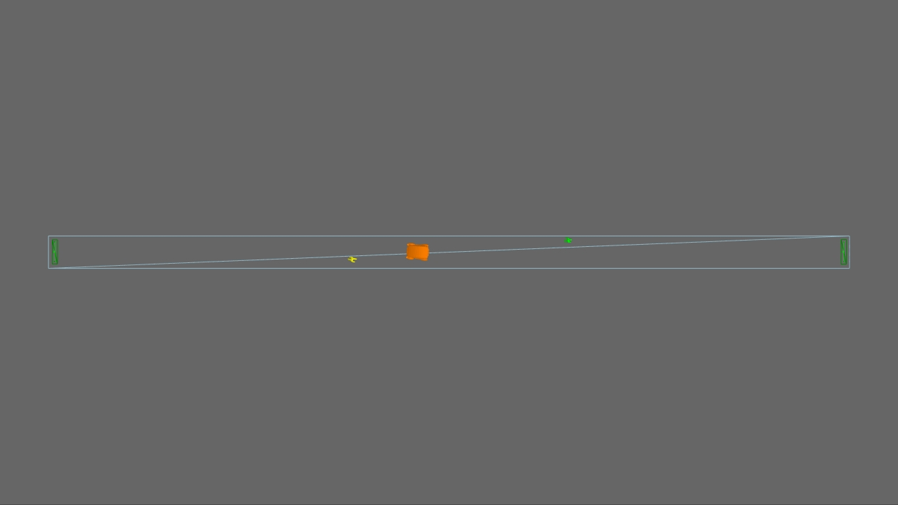
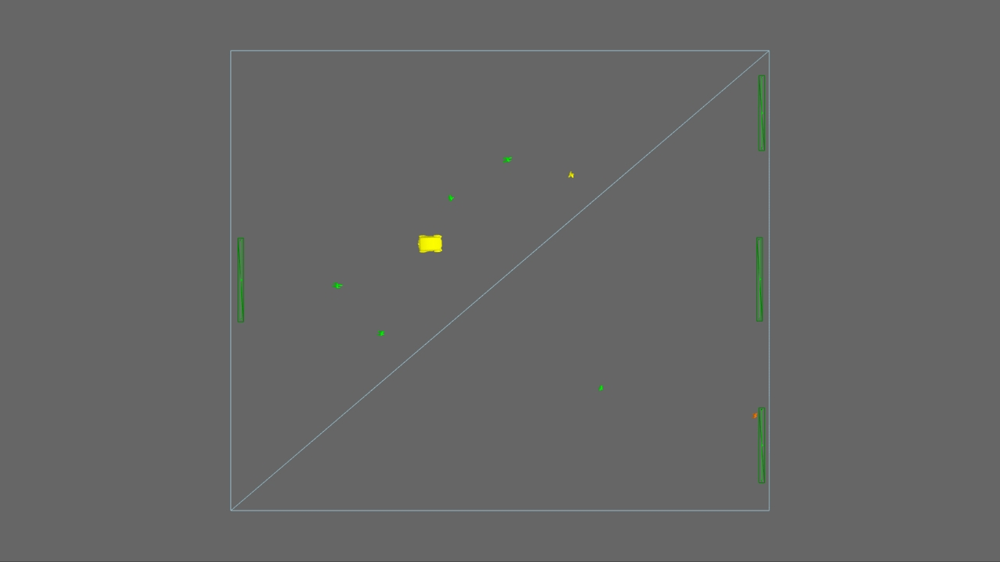

# Agent based simulation of the interactions between autonomous vehicles and pedestrians

### Overview
Autonomous vehicles are increasingly becoming a viable means of transportation and autonomous pods, which operate in
pedestrianised areas, have been conceived as a last mile transportation solution. The goal of this project is to model
how effective this type of vehicle will be, at operating in different environments of various sizes and busyness, and
also to analyse how the layout of cities could be altered to better facilitate this transportation system.

### Examples
Attached are three videos which outline the capabilities and behaviour of the pod agent. The autonomous pod agents are
designed to operate on floors with a minimum dimension of 2m (the approximate pod width) and which have no obstacles
placed on them (apart from other agents).

1) The 'path test' video demonstrates how the autonomous pod interacts with a pod on a narrow floor.

2) The 'square test' video illustrates a pod's behaviour in an open environment.

3) The 'example journey' video highlights how these agents can be run in virtual city environments to simulate their
use in the real-world (the city model shown in this video was created by Sketchup Placemaker and was then imported
into Massmotion).

### Getting Started
1) This project requires a licence for MassMotion 9.0.
(http://www.oasys-software.com/products/engineering/massmotion.html)
2) Install MassMotion and its SDK, detailed instructions can be found in the user guide:
(http://www.oasys-software.com/media/Manuals/Latest_Manuals/MassMotion.pdf)
3) Install Python 3.4 (or create a virtual environment) as this project uses Python as a scripting language and
MassMotion's SDK only works with Python 3.4.
4) Follow the setup instructions for the Python SDK (follow the SDK documentation which comes with the installation).
5) Clone this repository into the directory containing the example Python scripts installed by MassMotion (again a
detailed explanantion is provided in the SDK guide).
3) Run either pathTest.py or squareTest.py as an initial test.
4) Open the corresponding .mmdb file produced by this test to view the simulation results.

### Creating & altering tests
Changes to the MassMotion environments can be made by editing the pathTest.mm and squareTest.mm files. Changes include
altering the floor dimensions, the number of pedestrians travelling between goals created on the floor and adjusting
the positions of the goals themselves.

The pod's and pedestrian's attributes and methods can be edited by altering the corresponding python files in your
cloned repository. A class diagram illustrates how these extensions fit into the wider MassMotion environment and a
sequence diagram is provided to show they interact with each other.

### Author
Robert Tinn
robertdavidtinn@gmail.com
